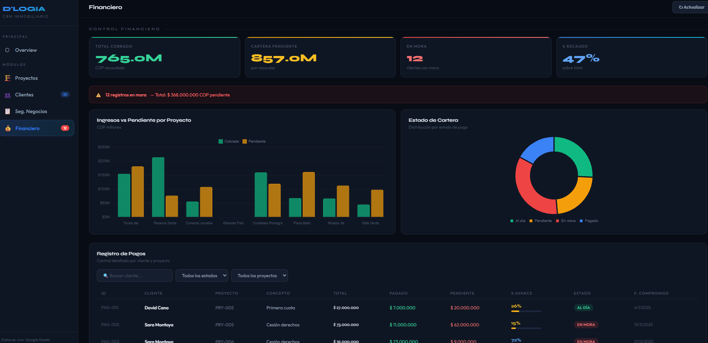

# 🏗️ Real Estate CRM Dashboard

> **Live CRM system for real estate companies** — Built with Google Sheets as database, Apps Script as REST API, and a pure HTML/CSS/JS interactive dashboard. No servers. No paid licenses. Real-time data.



[](https://your-netlify-url.netlify.app)
[](https://developers.google.com/apps-script)
[](LICENSE)

---

## 📌 Overview

A fully functional **end-to-end CRM system** designed for real estate companies in emerging markets. The entire stack runs on zero-cost infrastructure, making it accessible for SMEs without IT budgets.

**The problem it solves:** Real estate teams in Colombia manage leads, projects, deals, and finances across disconnected Excel files with no visibility. This system centralizes everything into a live dashboard.

---

## 🏛️ Architecture

```
┌─────────────────────┐     ┌──────────────────────┐     ┌─────────────────────┐
│   Google Sheets     │────▶│   Apps Script API    │────▶│   HTML Dashboard    │
│   (Database)        │     │   (REST Endpoint)    │     │   (Frontend)        │
│                     │     │                      │     │                     │
│  🏠 Projects        │     │  doGet() → JSON      │     │  5 Views            │
│  👥 Clients         │     │  KPI calculation     │     │  Chart.js graphs    │
│  📋 Deal Tracking   │     │  Data aggregation    │     │  Real-time filters  │
│  💰 Financial       │     │  Public endpoint     │     │  Live data          │
└─────────────────────┘     └──────────────────────┘     └─────────────────────┘
```

---

## ✨ Features

### 5 Interactive Modules
| Module | Description |
|--------|-------------|
| ⬡ **Overview** | Executive KPIs + portfolio summary + top charts |
| 🏗️ **Projects** | Full portfolio table + composition donut + price comparison |
| 👥 **Clients** | Conversion funnel + lead sources + filterable directory |
| 📋 **Deal Tracking** | Commercial funnel with COP values + advisor ranking + filters |
| 💰 **Financial** | Collections vs. pending + overdue alerts + payment registry |

### Technical Highlights
- ✅ Real-time data via Google Apps Script Web App (REST API)
- ✅ Zero backend — Apps Script serves JSON directly
- ✅ Dynamic filters and search across all tables
- ✅ Automatic overdue payment alerts
- ✅ Responsive sidebar navigation (no page reloads)
- ✅ Professional dark UI with Chart.js visualizations
- ✅ Deployable anywhere (Netlify, GitHub Pages, local)

---

## 🗂️ Project Structure

```
real-estate-crm-dashboard/
│
├── 📄 index.html                  # Main dashboard (single file)
├── 📄 api/
│   └── Code.gs                    # Google Apps Script — REST API
├── 📄 database/
│   └── CRM_Inmobiliario.xlsx      # Sample database (import to Google Sheets)
├── 📄 assets/
│   └── preview.png                # Dashboard screenshot
└── 📄 README.md
```

---

## 🚀 Setup Guide

### Step 1 — Set up the Database
1. Download `database/CRM_Inmobiliario.xlsx`
2. Import it to **Google Sheets** (File → Import)
3. You should have 4 sheets: `🏠 Proyectos`, `👥 Clientes`, `📋 Pipeline Comercial`, `💰 Financiero`

### Step 2 — Deploy the API
1. In your Google Sheet, go to **Extensions → Apps Script**
2. Paste the contents of `api/Code.gs`
3. Replace `SS_ID` with your Google Sheets ID (from the URL)
4. Click **Deploy → New Deployment**
5. Type: **Web App** | Execute as: **Me** | Access: **Anyone**
6. Copy the generated **Web App URL**

### Step 3 — Connect the Dashboard
1. Open `index.html`
2. Find line with `const API = "..."` and replace with your Web App URL
3. Open the file in your browser — data loads automatically ✅

### Step 4 — Deploy (Optional)
```bash
# Option A: Netlify Drop
# Drag and drop index.html at netlify.com/drop

# Option B: GitHub Pages
git init
git add .
git commit -m "initial commit"
git branch -M main
git remote add origin https://github.com/YOUR_USER/real-estate-crm-dashboard.git
git push -u origin main
# Enable GitHub Pages in repo settings → Pages → main branch
```

---

## 📊 Data Model

```
🏠 Projects          👥 Clients           📋 Deals              💰 Financial
─────────────        ──────────────       ──────────────        ──────────────
ID                   ID                   ID                    ID
Name                 Full Name            Client                Client
Type                 Phone                Project               Project
City                 Email                Unit                  Concept
Sector               City                 Advisor               Total Value
Total Units          Project Interest     Stage                 Amount Paid
Sold                 Source               Value (COP)           Amount Pending
Reserved             Advisor              Probability           % Progress
Available            Stage                Open Date             Payment Date
Price/m²             Contact Date         Est. Close Date       Payment Status
Status               Follow-up Date       Days in Stage         Advisor
```

---

## 🛠️ Tech Stack

| Layer | Technology | Purpose |
|-------|-----------|---------|
| Database | Google Sheets | Structured data storage |
| API | Google Apps Script | REST endpoint, data processing |
| Frontend | HTML5 + CSS3 + Vanilla JS | Dashboard UI |
| Charts | Chart.js 4.4 | Data visualization |
| Typography | Syne + Outfit (Google Fonts) | UI design |
| Hosting | Netlify / GitHub Pages | Static deployment |

---

## 💡 Why This Stack?

Most CRM solutions for small real estate firms in Colombia cost **$200-500 USD/month**. This system achieves the same result at **$0/month** using tools the team already knows (Google Sheets), with a professional frontend that impresses clients and stakeholders.

> *"The best data tool is the one your team actually uses."*

---

## 📈 Business Value

- **Centralizes** leads, deals, projects, and finances in one view
- **Eliminates** manual Excel consolidation (estimated 3-5 hrs/week saved)
- **Alerts** on overdue payments automatically
- **Ranks** advisors by closed deals in real time
- **Tracks** conversion funnel from lead to closed deal

---

## 🤝 About

Built by **[Juan Camilo](https://github.com/Juancanchala)** · [D'LOGIA](https://dlogia.tech) — Data Analytics & Automation

> This project is part of D'LOGIA's portfolio of data solutions for Colombian SMEs.
> Interested in a custom version for your business? [Get in touch](https://dlogia.tech)

---

## 📄 License

MIT License — free to use, modify, and distribute with attribution.
